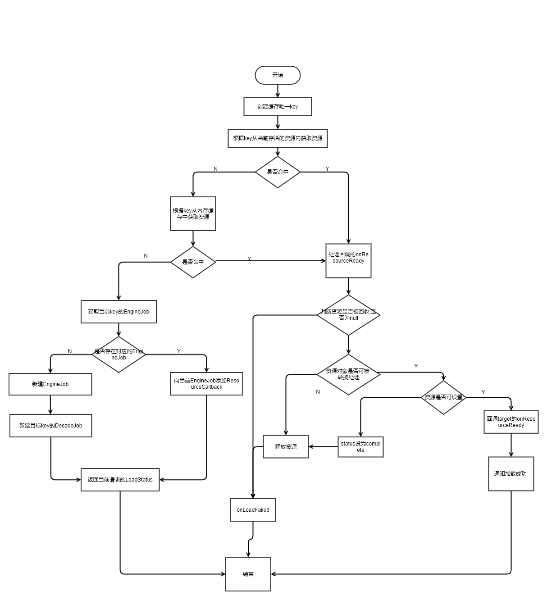
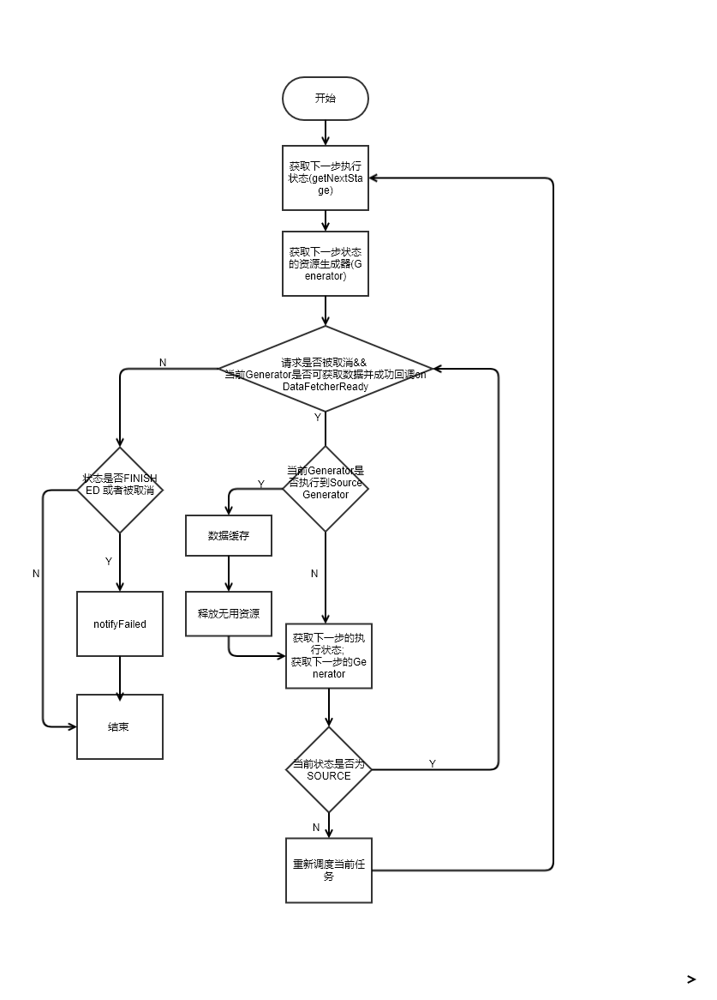

title: Glide源码解析
date: 2017-12-22 00:00:00
categories:
- android学习记录
- 源码解析
tags:
- android
- Glide
- 源码解析
---
基于v4最新版本的Glide解析, 从最开始的简单加载开始看源码, 仅作个人记录.
<!-- more -->
一个Glide加载图片的核心用法如下:
``` java
GlideApp.with(this)
                .load(uri)
                .into(imageViewLookup);
```
我们通过一步步链式调用进去查看
## Glide.with : 同步生命周期
``` java
private RequestManager supportFragmentGet(@NonNull Context context, @NonNull FragmentManager fm,
      @Nullable Fragment parentHint) {
    SupportRequestManagerFragment current = getSupportRequestManagerFragment(fm, parentHint);
    RequestManager requestManager = current.getRequestManager();
    if (requestManager == null) {
      Glide glide = Glide.get(context);
      requestManager =
          factory.build(
              glide, current.getGlideLifecycle(), current.getRequestManagerTreeNode(), context);
      current.setRequestManager(requestManager);
    }
    return requestManager;
  }
```
通过`getSupportRequestManagerFragment(final FragmentManager fm, Fragment parentHint)`方法调用, 在`Glide.with(context)`中传入的组件中,
新增一个子Fragment, 这个Fragment类根据传入的是`support.fragment`或者是`fragment`来决定是`RequestManagerFragment`还是`SupportRequestManagerFragment`,然后通过`current.SupportRequestManagerFragment()` 将Glide的生命周期与这个子fragment的声明周期绑定, 实现了组件与Glide加载同步的功能
## 图片的加载
我们通过暴露的into的API跳进去, 最终到了`RequestBuilder.into(@NonNull Y target, @Nullable RequestListener<TranscodeType> targetListener, @NonNull RequestOptions options)`, 详细代码如下:
``` java
private <Y extends Target<TranscodeType>> Y into(
      @NonNull Y target,
      @Nullable RequestListener<TranscodeType> targetListener,
      @NonNull RequestOptions options) {
    // 判断是否在主线程
    Util.assertMainThread();
    // target是否为空判断
    Preconditions.checkNotNull(target);
    // load()方法是否已经被调用, 如果没被调用, 则将抛出异常
    if (!isModelSet) {
      throw new IllegalArgumentException("You must call #load() before calling #into()");
    }
    options = options.autoClone();
    // 创建请求
    Request request = buildRequest(target, targetListener, options);
    // 获取target当前的请求
    Request previous = target.getRequest();
    // 如果请求相同, 而且当前请求设置可以使用内存缓存
    // 则请求回收
    if (request.isEquivalentTo(previous)
        && !isSkipMemoryCacheWithCompletePreviousRequest(options, previous)) {
      request.recycle();
      // If the request is completed, beginning again will ensure the result is re-delivered,
      // triggering RequestListeners and Targets. If the request is failed, beginning again will
      // restart the request, giving it another chance to complete. If the request is already
      // running, we can let it continue running without interruption.
      // 如果当前请求不在执行, 则会重新开始请求
      if (!Preconditions.checkNotNull(previous).isRunning()) {
        // Use the previous request rather than the new one to allow for optimizations like skipping
        // setting placeholders, tracking and un-tracking Targets, and obtaining View dimensions
        // that are done in the individual Request.
        previous.begin();
      }
      return target;
    }
    requestManager.clear(target);
    target.setRequest(request);
    // 请求追踪
    requestManager.track(target, request);

    return target;
  }
```
然后通过`requestManager.track()`发起Request执行, 如果当前状态(`status`)既不是`RUNNING`也不是`COMPLETE`, 则会执行`onSizeReady`, 到这里直到`Engine.load()`才开始资源的加载, 相关的代码及注释如下:
``` java
public <R> LoadStatus load(
      GlideContext glideContext,
      Object model,
      Key signature,
      int width,
      int height,
      Class<?> resourceClass,
      Class<R> transcodeClass,
      Priority priority,
      DiskCacheStrategy diskCacheStrategy,
      Map<Class<?>, Transformation<?>> transformations,
      boolean isTransformationRequired,
      boolean isScaleOnlyOrNoTransform,
      Options options,
      boolean isMemoryCacheable,
      boolean useUnlimitedSourceExecutorPool,
      boolean useAnimationPool,
      boolean onlyRetrieveFromCache,
      ResourceCallback cb) {
    Util.assertMainThread();
    long startTime = LogTime.getLogTime();
    // 创建缓存key
    EngineKey key = keyFactory.buildKey(model, signature, width, height, transformations,
        resourceClass, transcodeClass, options);

    // 从存活资源内读取数据, 内部缓存由value为弱引用对象的map做管理, 做手动的计数管理
    // 当资源计数为0时, 则回收
    EngineResource<?> active = loadFromActiveResources(key, isMemoryCacheable);
    if (active != null) {
      // 如果命中, 则回调加载
      cb.onResourceReady(active, DataSource.MEMORY_CACHE);
      if (Log.isLoggable(TAG, Log.VERBOSE)) {
        logWithTimeAndKey("Loaded resource from active resources", startTime, key);
      }
      return null;
    }

    // 获取内存缓存数据
    // 当内存缓存中有命中, 则删除Cache, 并将目标资源加到activeResources中
    EngineResource<?> cached = loadFromCache(key, isMemoryCacheable);
    if (cached != null) {
      // 如果命中, 则回调加载
      cb.onResourceReady(cached, DataSource.MEMORY_CACHE);
      if (Log.isLoggable(TAG, Log.VERBOSE)) {
        logWithTimeAndKey("Loaded resource from cache", startTime, key);
      }
      return null;
    }
    //  EngineJob : 调度DecodeJob，添加，移除资源回调，并notify回调
    EngineJob<?> current = jobs.get(key, onlyRetrieveFromCache);
    // 当前存活的资源和内存缓存都没有的情况下
    // 1. 先判断是否有资源(resouce什么时候回调true 不明), 如果有, 则回调加载
    // 2. 如果加载失败, 则加载抛出异常
    // 3. 否则, 在资源回调中添加
    if (current != null) {
      current.addCallback(cb);
      if (Log.isLoggable(TAG, Log.VERBOSE)) {
        logWithTimeAndKey("Added to existing load", startTime, key);
      }
      // 返回当前的LoadStatus
      return new LoadStatus(cb, current);
    }
    // 当资源回调中都没有的情况
    EngineJob<R> engineJob =
        engineJobFactory.build(
            key,
            isMemoryCacheable,
            useUnlimitedSourceExecutorPool,
            useAnimationPool,
            onlyRetrieveFromCache);

    // 实现了Runnable接口，调度任务的核心类，整个请求的繁重工作都在这里完成：处理来自缓存或者原始的资源，应用转换动画以及transcode。
    // 负责根据缓存类型获取不同的Generator加载数据，数据加载成功后回调DecodeJob的onDataFetcherReady方法对资源进行处理
    DecodeJob<R> decodeJob =
        decodeJobFactory.build(
            glideContext,
            model,
            key,
            signature,
            width,
            height,
            resourceClass,
            transcodeClass,
            priority,
            diskCacheStrategy,
            transformations,
            isTransformationRequired,
            isScaleOnlyOrNoTransform,
            onlyRetrieveFromCache,
            options,
            engineJob);

    jobs.put(key, engineJob);

    engineJob.addCallback(cb);
    engineJob.start(decodeJob);

    if (Log.isLoggable(TAG, Log.VERBOSE)) {
      logWithTimeAndKey("Started new load", startTime, key);
    }
    return new LoadStatus(cb, engineJob);
  }
```
这里的流程图可以看下图:

## 资源图片的缓存
当无法再当前存活的资源以及缓存内找到对应key的资源时, 会通过`engineJob`开始执行`decodeJob`, 所以我们可以直接看`decodeJob`的`run()`.
``` java
/**
   * 根据不同的runReason执行不同任务
   */
  private void runWrapped() {
     switch (runReason) {
       // 首次请求时
      case INITIALIZE:
        stage = getNextStage(Stage.INITIALIZE);
        currentGenerator = getNextGenerator();
        // load数据
        runGenerators();
        break;
      case SWITCH_TO_SOURCE_SERVICE:
        // load数据
        runGenerators();
        break;
      case DECODE_DATA:
        // 数据处理
        decodeFromRetrievedData();
        break;
      default:
        throw new IllegalStateException("Unrecognized run reason: " + runReason);
    }
  }
```
核心的执行流程如下代码:
``` java
/**
   * 执行Generators
   */
  private void runGenerators() {
    // 获取当前线程
    currentThread = Thread.currentThread();
    startFetchTime = LogTime.getLogTime();
    boolean isStarted = false;
    // currentGenerator.startNext() : 从当前策略对应的Generator获取数据，数据获取成功则回调DecodeJob的onDataFetcherReady对资源进行处理。否则尝试从下一个策略的Generator获取数据
    while (!isCancelled && currentGenerator != null
        && !(isStarted = currentGenerator.startNext())) {
      stage = getNextStage(stage);
      // 根据Stage获取到相应的Generator后会执行currentGenerator.startNext()，如果中途startNext返回true，则直接回调，否则最终会得到SOURCE的stage，重新调度任务
      currentGenerator = getNextGenerator();

      if (stage == Stage.SOURCE) {
        // 重新调度当前任务
        reschedule();
        return;
      }
    }
    // We've run out of stages and generators, give up.
    if ((stage == Stage.FINISHED || isCancelled) && !isStarted) {
      notifyFailed();
    }

    // Otherwise a generator started a new load and we expect to be called back in
    // onDataFetcherReady.
  }
```
我们看下DecodeJob的执行流程

## 总结
到这里, 整体的流程大致是搞清楚了, 至于说是缓存的原理机制, 在之前`Engine.load()`的方法内, 删除缓存的方法进去可以看到一个`LruCache`的类文件, 从名字可以推断是Glide自己实现的`Lru算法`作为缓存的处理, 关于Lru的算法原理, 在本篇内就不再做赘述了, 而`ActiveCache`用到了`引用计数`算法.
Glide用到了大量的抽象工厂类, 另外方法内经常是包括了十来个参数, 在阅读的经过上还是有点困难(对我而言).
相应的代码注释可看[Github上我补充的注释](https://github.com/YuTianTina/glide)
