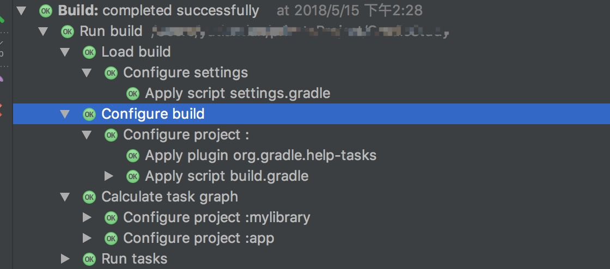

title: 记录一次Gradle的踩坑
date: 2018-05-15 00:00:00
categories :
- 日常开发踩坑记录
tags:
- android
- gradle
---
### 前提背景
来了新公司后第一个任务是给项目升级支持gradle插件3.0, 这个当初还是3.0.1的时候就做过, 所以并没有什么难度, 但是顺带要将内部的热更新插件同样升级碰到了个百思不得其解的问题.
<!-- more -->
### 问题
我们先看下出现问题的伪代码, 当我在AS上需要编译运行项目的时候, 会提示`dexTask`为空的错误信息, 而在同事的PC上却可以顺利的运行.(gradle插件环境都是3.0.1, gradle使用的是4.1版本)
``` groovy
afterEvaluate{
  android.buildTypes.each{
    type ->
    def typeName = type.name
    if("release" == typeName){
        def dexTask = project.tasks.findByName("transformClassesWithDexForRelease")
        // 针对于dexTask的逻辑处理...
    }
  }
}
```
由于`Gradle`开发经验少的可怜, 所以此次我们一行行来看代码
### Gradle的执行流程
要解释`afterEvaluate`, 我们必须先了解Gradle的执行流程.它主要可分为三个步骤
1. 初始化, 解析`settings.gradle`, 根据module生成对应`project`的实例
2. 配置, 解析每个`project`, 获取对应的`task`
3. 执行task

当然这一块流程, 我们可以从AS的Build上分析得出.

然后我们再回头说到`afterEvaluate`, 它是在配置阶段后, 已经获取对应`project`的`task`后, 回调执行的.具体可以看[官方文档的说明](https://docs.gradle.org/current/javadoc/org/gradle/api/Project.html#afterEvaluate-groovy.lang.Closure-)(这里放的是最新版本的API文档, 要看对应版本的文档, 可以看本地的gradle文件夹内的javadoc文档)
### 问题和解决
ok, 那么关于`afterEvaluate`我们已经了解了, 再往下看,`android.buildTypes.each`就是对`project`的配置的`buildType`进行遍历, 然后当`buildType`为`release`的时候, 获取对应`buildType`的`transformClassesWithDex`.
而在调试的过程中, 我发现走debug的时候`transformClassesWithDexForDebug`是有的, 可以看出配置阶段只会获取当前`buildType`的task.
那么现在我们要做的就是改为判断当前`buildType`为`release`的时候, 再获取对应的task.
``` groovy
android.applicationVariants.all{
    variant ->
      variant.outputs.each{
        type ->
        if("release" == type.name){
          def dexTask = project.tasks.findByName("transformClassesWithDexForRelease")
          // 针对于dexTask的逻辑处理...
        }
      }
}
```
然后这里还有个问题, 我们已知task的获取是要在配置结束后才能获得的, 这里不通过`afterEvaluate`是否可以获取到对应的task? 这块我们可以看下源码注释
``` java
/**
     * Returns a collection of <a
     * href="https://developer.android.com/studio/build/build-variants.html">build variants</a> that
     * the app project includes.
     *
     * <p>To process elements in this collection, you should use the <a
     * href="https://docs.gradle.org/current/javadoc/org/gradle/api/DomainObjectCollection.html#all(org.gradle.api.Action)">
     * <code>all</code></a> iterator. That's because the plugin populates this collection only after
     * the project is evaluated. Unlike the <code>each</code> iterator, using <code>all</code>
     * processes future elements as the plugin creates them.
     *
     * <p>The following sample iterates through all <code>applicationVariants</code> elements to <a
     * href="https://developer.android.com/studio/build/manifest-build-variables.html">inject a
     * build variable into the manifest</a>:
     *
     * <pre>
     * android.applicationVariants.all { variant -&gt;
     *     def mergedFlavor = variant.getMergedFlavor()
     *     // Defines the value of a build variable you can use in the manifest.
     *     mergedFlavor.manifestPlaceholders = [hostName:"www.example.com/${variant.versionName}"]
     * }
     * </pre>
     */
    public DomainObjectSet<ApplicationVariant> getApplicationVariants() {
        return applicationVariantList;
    }
```
`all`与`each`不同, 他只会在`configuration`阶段后进行获取填充.
## 其他
至于为什么同事的PC上可以运行, 我的不行, 后来排查下来, 应该是在AS`3.1.2`版本(同事的AS是3.0.1)在执行获取配置这块, 校验更为严格的原因. 但是具体的我并没有查询相关的文档.
## 总结
其实本次问题并不难解决, 可能是前期因为同事可以运行, 本地环境却不能运行的状况给搞懵逼了. 但是后来还是顺利解决了.关于Gradle, 这次的踩坑经验是教了我去看官方API...虽然说Gradle的文档是真的好难定位
