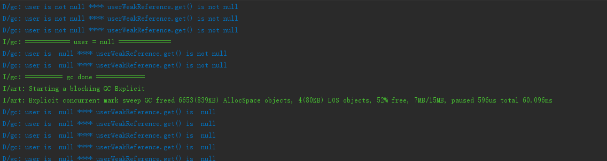

title: 谈谈GC和引用
date: 2018-01-12 00:00:00
categories :
- Java
tags:
- java
- JVM
---
## 前言
A拿了一串代码和[一篇文章](http://www.cnblogs.com/absfree/p/5555687.html)来问我,

      ...当productA变为null时（表明它所引用的Product已经无需存在于内存中），这时指向这个Product对象的就是由弱引用对象weakProductA了，那么显然这时候相应的Product对象时弱可达的，
      所以指向它的弱引用会被清除，这个Product对象随即会被回收，指向它的弱引用对象会进入引用队列中。
根据文章上述引用内容, 当他在执行下文代码的`putnull`方法时, 为什么`userWeakReference.get()`对象不为null, 难道`userWeakReference.get()` 和 `user` 不是一个对象吗?
``` java
public class MainActivity extends AppCompatActivity {
    private User user;
    public static final int period = 2000;
    private WeakReference<User> userWeakReference;
    @Override
    protected void onCreate(Bundle savedInstanceState) {
        super.onCreate(savedInstanceState);
        setContentView(R.layout.activity_main);

        user = new User();
        userWeakReference = new WeakReference<>(user);

        Observable.interval(period, TimeUnit.MILLISECONDS)
                .subscribe(new Consumer<Long>() {
                    @Override
                    public void accept(Long aLong) throws Exception {
                        Log.d("gc", String.format("user is %s null", (null == user) ? "" : "not") +
                                String.format(" ****" +
                                        " userWeakReference.get() is %s null", (null == userWeakReference.get()) ? "" : "not"));
                    }
                });

    }

    public void putnull(View view) {
        Log.i("gc", "============ user = null ==============");
        user = null;
    }

    public void excutegc(View view) {
        Log.i("gc", "========== gc done =============");
        System.runFinalization();
        System.gc();

    }
}
```
<!-- more -->
我们不妨先看下打印日志
当`user`为空的时候, `userWeakReference.get()`不为空, 直到GC以后, 才为空.
## 对象的初始化
这个问题的道理其实很简单.首先我们来看下下面代码的含义
``` java
User user = new User();
```
当虚拟机遇到一条`new`指令的时候, 在类加载检查通过以后, 会为新生对象分配内存, 然后将分配到的内存空间都初始化为零值, 然后通过对象头(Object Header)对对象进行一些必要的设置(譬如对象GC分代年龄等等), 最后, 把对象按照程序员的意愿进行初始化(执行`<init>`方法), 这个时候, 从Java程序角度上来讲, 一个新的对象就产生了.而`user`这个引用变量通过`=`指向的就是这个新生成的对象的内存地址.

需要注意的是, 真正的对象是`new User()`, 而`user`表示的是引用.

这时候当我们执行下面的代码
``` java
user = null;
```
`null`既不是对象, 也不是类型, 它是一种特殊的值, 这里可以表示为`user`引用没有指向任何对象.但是从内存分配上来说, `new User()`这个对象仍然存在, 只是没有引用指向它.
``` java
/**
     * Returns this reference object's referent.  If this reference object has
     * been cleared, either by the program or by the garbage collector, then
     * this method returns <code>null</code>.
     *
     * @return   The object to which this reference refers, or
     *           <code>null</code> if this reference object has been cleared
     */
    public T get() {
        return getReferent();
    }
```
然后我们看下`Reference.get()`返回的是什么, 这个源码的注释给了我们答案, 它指向目标引用地址.那么我们就可以解释, 为什么`user`为空的时候, `userWeakReference.get()`仍然不为空.
## GC
我们先复习下GC的一些基础知识
### 如何判断对象可回收
在当前常用的虚拟机, 都是使用`可达性分析算法`, 通过可达判断(`GC Root`作为起始点, 引用链向下搜索, 如果对象和GC Root之前没有引用链, 则认为不可达, 即GC可回收)GC是否可以回收.`GC Roots`的对象可包括以下几种:
- 虚拟机栈中引用的对象
- 方法区中类静态属性引用的对象
- 方法区中常量引用的对象
- 本地方法栈中JNI(Native方法)引用的对象

### 引用级别
同样, 我们在看下`WeakReference`是什么. 在判断对象的引用链是否可达的时候, 我们都需要用到引用.引用级别可分为四层, 引用强度分别自强到弱
- 强引用: 代码中最常见的, 譬如上面的`user`就是强引用, 强引用只要存在, GC就永远不会回收它
- 软引用`SoftReference`: 软引用只有在内存不足时, GC才会回收. 当要发生OOM的时候, GC会把这些对象列进回收范围进行第二次回收, 如果这次回收后还是没有足够的内存, 则会报OOM
- 弱引用`WeakReference`: 无论内存是否足够, GC肯定会回收. 所以弱引用关联的对象无法存活到下一次GC.`LeakCanary`就是通过使用`WeakReference`和引用队列通过二次回收判定来判断是否存在内存泄漏.
- 虚引用`PhantomReference`:最弱的一种引用关系, 一个对象是否有虚引用的存在, 完全不会对其生存时间构成影响, 也无法通过虚引用来取得一个对象实例。他存在的唯一目的即是能在这个对象被收集器回收时受到一个系统通知.

## 结论
  由此可以理解, 当发生GC时, `WeakReference`引用相关的对象就不会再存活, 这也是为什么,上面的代码里, 要等到GC发生后`userWeakReference.get()`才为空.

  从这个问题我们引申出来的还是比较基础的东西, 不过不妨碍我们再去做一次巩固.
